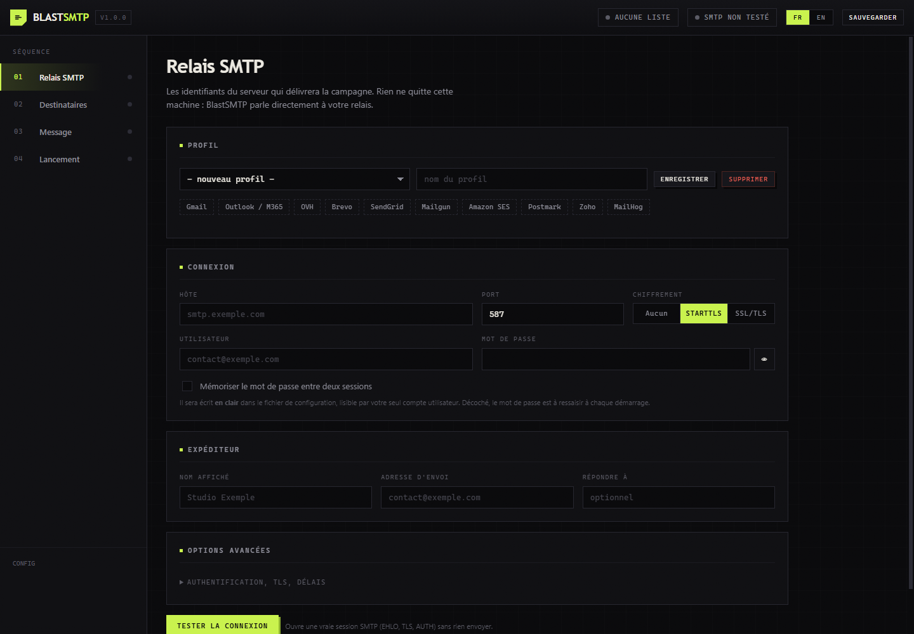

# BlastSMTP

Envoi d'emails en masse, dans un seul binaire Go.

<div align="center">
  
</div>

Vous renseignez votre relais SMTP, vous importez une liste CSV ou TXT, vous rédigez un message avec des variables par destinataire, puis vous lancez. La progression s'affiche en direct et vous pouvez suspendre ou couper à tout moment.

Aucun service tiers, aucun compte à créer. Le binaire sert une console web locale et parle directement à votre propre serveur SMTP.

*[English version](README.md)*

## Sommaire

- [Ce que fait l'outil](#ce-que-fait-loutil)
- [Installation](#installation)
- [Démarrage](#démarrage)
- [Formats de liste](#formats-de-liste)
- [Variables](#variables)
- [Configuration SMTP](#configuration-smtp)
- [Cadence et délivrabilité](#cadence-et-délivrabilité)
- [Pièces jointes et images intégrées](#pièces-jointes-et-images-intégrées)
- [Sécurité](#sécurité)
- [API HTTP](#api-http)
- [Compilation](#compilation)
- [Développement](#développement)
- [Usage responsable](#usage-responsable)
- [Licence](#licence)

## Ce que fait l'outil

**Un seul binaire.** L'interface web est embarquée via `go:embed`. Aucune dépendance à l'exécution, uniquement la bibliothèque standard.

**Interface bilingue.** Français et anglais, permutables d'un clic sans rechargement. Le choix est mémorisé et s'applique aussi aux en-têtes du rapport CSV.

**Utilisable partout.** Mise en page responsive du grand écran au téléphone, et fonctionnement intégral hors-ligne. Les polices web sont un agrément, jamais une dépendance.

**Test de connexion réel.** Ouvre une vraie session SMTP (EHLO, STARTTLS, AUTH) et rapporte latence, version TLS, chiffrement, extensions annoncées et taille maximale acceptée, sans rien envoyer.

**Import tolérant.** CSV, TSV et TXT. Séparateur, ligne d'en-tête et colonne d'adresse détectés automatiquement. BOM géré, doublons écartés, lignes invalides listées à part avec leur motif.

**Variables modulaires.** Chaque colonne devient `{{colonne}}`. S'y ajoutent des compteurs incrémentaux, des dates, des valeurs aléatoires, de l'alternance de formulations, des transformations de casse et des valeurs de repli.

**Aperçu fidèle.** Rend le message exactement tel que le destinataire numéro N le recevra, tirages aléatoires compris. La même graine sert à l'aperçu et à l'envoi.

**Envoi de test.** Un message vers votre propre adresse, rendu avec les données d'un vrai destinataire.

**Cadence maîtrisée.** Connexions parallèles, plafond de messages par minute, lots avec temps de pause, réessais avec temporisation croissante, reconnexion périodique.

**Supervision en direct.** Compteurs, progression, débit, temps restant estimé, journal ligne à ligne. Suspendre, reprendre ou arrêter quand vous voulez.

**Rapport CSV.** Résultat par destinataire avec code SMTP et message d'erreur, exportable pour analyse.

**Mode simulation.** Rend et valide chaque message sans ouvrir la moindre connexion. Rien ne quitte la machine.

## Installation

### Depuis une release

Récupérez l'exécutable de votre plateforme dans [Releases](../../releases) et lancez-le. Rien à installer.

### Avec Go

```bash
go install github.com/aprilox/blastsmtp@latest
```

### Depuis les sources

```bash
git clone https://github.com/aprilox/blastsmtp.git
cd blastsmtp
```

Sous Windows, l'extension `.exe` est indispensable. Sans elle, Go écrit un fichier que Windows refuse de lancer :

```powershell
go build -o blastsmtp.exe .
.\blastsmtp.exe
```

Sous Linux et macOS :

```bash
go build -o blastsmtp .
./blastsmtp
```

La compilation demande Go 1.26 ou plus récent. L'exécution ne demande rien.

> Le chemin du module respecte la casse. Si vous republiez sous un autre compte, remplacez `aprilox` dans [go.mod](go.mod) *et* dans les imports des fichiers `.go`, puis lancez `go mod tidy`.

## Démarrage

```bash
./blastsmtp
```

```
  BlastSMTP 1.0.0
  Console   http://127.0.0.1:7333/?token=8f3c...
  Config    C:\Users\vous\AppData\Roaming\BlastSMTP\config.json
  Ctrl+C to quit
```

Le navigateur s'ouvre tout seul. Ensuite, dans l'ordre :

1. **Relais SMTP.** Un préréglage (Gmail, Outlook, OVH, Brevo, SendGrid et d'autres) remplit hôte et port, vous complétez les identifiants, puis **Tester la connexion**.
2. **Destinataires.** Glissez votre fichier. Les colonnes détectées apparaissent comme variables cliquables.
3. **Message.** Objet et corps HTML, variables insérées d'un clic, aperçu sur un destinataire réel, puis un **envoi de test** vers votre propre adresse.
4. **Lancement.** Réglez la cadence, passez le contrôle avant vol, et démarrez. Essayez d'abord en **simulation**.

### Options de ligne de commande

| Option | Défaut | Rôle |
|---|---|---|
| `-port` | `7333` | Port d'écoute. `0` en choisit un libre. |
| `-host` | `127.0.0.1` | Interface d'écoute. À laisser sur la boucle locale. |
| `-config` | dossier de config utilisateur | Emplacement du fichier de configuration. |
| `-no-browser` | | N'ouvre pas le navigateur au démarrage. |
| `-version` | | Affiche la version et quitte. |

## Formats de liste

**CSV et TSV.** Le séparateur est détecté parmi `,` `;` tabulation et `|` :

```csv
Prénom;Email;Société;Ville
Amélie;amelie@exemple.fr;ACME;Lyon
Bob;bob@exemple.fr;Globex;Paris
```

Chaque en-tête devient une variable : `{{prenom}}`, `{{societe}}`, `{{ville}}`.

Les accents sont repliés, donc une colonne `Prénom` répond à `{{prenom}}` et vous n'avez jamais à taper d'accent dans un placeholder.

La colonne d'adresse est reconnue sous une trentaine de noms courants (`email`, `e-mail`, `mail`, `courriel`, `adresse`, `destinataire` et d'autres) et reste toujours accessible via `{{email}}`, quel que soit son intitulé. Si aucun nom ne correspond, la colonne contenant le plus d'adresses valides est retenue.

**TXT.** Une adresse par ligne, `#` pour les commentaires :

```
# clients actifs
amelie@exemple.fr
Bob Martin <bob@exemple.fr>
```

Dans tous les cas le BOM UTF-8 est retiré, les doublons sont écartés sans tenir compte de la casse, et les lignes invalides sont listées à part avec leur motif. Rien n'est perdu en silence.

## Variables

Toute expression entre `{{ }}` est résolue au moment de l'envoi, dans l'objet, le corps HTML, le corps texte et les en-têtes personnalisés.

### Données du destinataire

| Variable | Résultat |
|---|---|
| `{{email}}` | Adresse du destinataire |
| `{{nom}}`, `{{prenom}}`, `{{ville}}` et ainsi de suite | N'importe quelle colonne de votre fichier |
| `{{prenom\|Client}}` | La colonne, ou `Client` si elle est vide ou absente |
| `{{emailuser}}` | Ce qui précède le `@` |
| `{{emaildomain}}` | Le domaine du destinataire |

### Compteurs

| Variable | Résultat |
|---|---|
| `{{index}}` | Position du destinataire : 1, 2, 3 et ainsi de suite |
| `{{index:1000}}` | Le même compteur démarrant à 1000 |
| `{{count}}` | Nombre total de destinataires |

Le point de départ se règle aussi globalement dans l'onglet **Lancement**, ce qui permet de reprendre une numérotation d'une campagne à l'autre.

### Date et heure

| Variable | Résultat |
|---|---|
| `{{date}}` | `04/08/2026` |
| `{{date:YYYY-MM-DD}}` | `2026-08-04` |
| `{{date:DD MMMM YYYY}}` | `04 August 2026` |
| `{{time}}` et `{{datetime}}` | `14:30` et `04/08/2026 14:30` |
| `{{year}}`, `{{month}}`, `{{day}}` | Composantes isolées |
| `{{timestamp}}` | Horodatage Unix |

Motifs acceptés : `YYYY YY MMMM MMM MM DDDD DDD DD HH hh mm ss A`.

### Aléatoire et variation

| Variable | Résultat |
|---|---|
| `{{rand:1000-9999}}` | Entier tiré dans l'intervalle |
| `{{randstr:8}}` | Chaîne alphanumérique de 8 caractères |
| `{{randnum:6}}` | Suite de 6 chiffres aléatoires |
| `{{randhex:8}}` | Chaîne hexadécimale aléatoire |
| `{{uuid}}` | Identifiant unique |
| `{{spin:Bonjour;Salut;Coucou}}` | Une variante au hasard, séparateur `;` |

Les tirages sont déterministes par destinataire : l'aperçu du destinataire 42 affiche exactement ce que le 42 recevra.

### Transformations

| Variable | Résultat |
|---|---|
| `{{upper:prenom}}` | `AMÉLIE` |
| `{{lower:email}}` | `amelie@exemple.fr` |
| `{{capitalize:prenom}}` | `Amélie` |
| `{{trim:ville}}` | Espaces de bord retirés |

### Exemple complet

```html
Objet : Commande n°{{index:1000}} confirmée, {{societe|votre commande}}

<p>{{spin:Bonjour;Bonjour à vous;Bonsoir}} {{capitalize:prenom|cher client}},</p>
<p>Votre commande <strong>n°{{index:1000}}</strong> du {{date}} est en préparation.</p>
<p>Code de suivi : {{randstr:6}}-{{randnum:4}}</p>
<p><a href="https://exemple.fr/desinscription?t={{token}}">Se désinscrire</a></p>
```

Une variable inconnue est remplacée par du vide et **signalée dans l'aperçu** avant l'envoi, jamais découverte après coup.

## Configuration SMTP

### Ports et chiffrement

| Port | Mode | Usage |
|---|---|---|
| 587 | STARTTLS | Le standard actuel. À privilégier. |
| 465 | SSL/TLS | TLS dès le premier octet. Toujours très répandu. |
| 25 | Aucun ou STARTTLS | Relais interne. Souvent bloqué en sortie par les FAI. |
| 1025 | Aucun | Serveurs de test locaux comme MailHog ou Mailpit. |

### Authentification

`Automatique` convient dans l'immense majorité des cas : la méthode est choisie d'après ce que le serveur annonce, en préférant `PLAIN` sur TLS. Forcez `LOGIN` pour les relais Exchange ou cPanel qui refusent `PLAIN`, `CRAM-MD5` si le serveur l'impose, `Aucune` pour un relais interne ouvert.

Les identifiants ne sont jamais transmis sur une connexion non chiffrée, sauf à cocher explicitement *Auth sans TLS*, réservé aux relais locaux.

### Pièges fréquents

- **Gmail ou Outlook avec double authentification.** Un mot de passe d'application est obligatoire, celui du compte sera refusé.
- **`STARTTLS non annoncé`.** Le serveur attend du TLS implicite. Passez en SSL/TLS sur le port 465.
- **Délai dépassé.** Le port sortant est bloqué par un pare-feu ou votre FAI. Très courant sur le port 25.
- **Certificat auto-signé.** Cochez *Ignorer le certificat*, en connaissance de cause.
- **`EHLO refusé`.** Renseignez un *Nom HELO* résolvable publiquement.
- **`connexion fermée par le serveur (EOF)`.** Ce n'est pas un rejet : le relais a raccroché sans répondre, généralement un quota. Baissez le débit, ou le seuil de reconnexion. La remise est ambiguë dans ce cas, donc un réessai peut produire un doublon.

## Cadence et délivrabilité

Réglages de l'onglet **Lancement** :

| Réglage | Effet |
|---|---|
| Connexions parallèles | Sessions SMTP simultanées. Une à quatre suffisent presque toujours ; au-delà, beaucoup de relais limitent. |
| Messages par minute | Plafond global, tous workers confondus. `0` retire la limite. |
| Taille de lot et pause | Insère un temps mort tous les N messages. C'est ce que la plupart des relais mutualisés attendent d'un envoi en volume. |
| Réessais | Nouvelles tentatives après une erreur temporaire (4xx, réseau) avec temporisation croissante. Les refus définitifs (5xx) ne sont jamais réessayés. |
| Reconnexion tous les | Ouvre une session neuve après N messages. Contourne les relais qui coupent après un quota. |
| Tout couper à la première erreur | Arrête tout au premier échec définitif. Utile pour un tir de contrôle. |

Quelques points qui pèsent bien plus lourd que la vitesse :

- Configurez **SPF, DKIM et DMARC** sur votre domaine expéditeur. Sans cela, le reste ne sert à rien.
- Renseignez le **lien de désinscription**. L'outil ajoute alors les en-têtes `List-Unsubscribe` et `List-Unsubscribe-Post` que Gmail et Outlook réclament pour les envois en volume.
- Fournissez une **version texte** en plus du HTML. Un message multipart est mieux noté. Le bouton *Générer depuis le HTML* s'en charge.
- **Montez progressivement** en volume sur un domaine ou une IP récente.
- Envoyez-vous un **message de test** avant chaque campagne et lisez-le dans un vrai client de messagerie.

## Pièces jointes et images intégrées

Déposez vos fichiers dans l'onglet **Message**. La limite est de 25 Mo au total, ce que les relais acceptent au mieux.

Les images offrent deux modes, permutables d'un clic :

- **Jointe.** Un fichier classique en pièce jointe.
- **Intégrée.** L'image est placée dans un conteneur `multipart/related` et référençable depuis le HTML. Le bouton `cid:` insère la balise complète :

```html

```

L'arbre MIME produit est le plus simple qui convienne au contenu :

```
multipart/mixed             seulement s'il y a des pièces jointes
  multipart/related         seulement s'il y a des images intégrées
    multipart/alternative   seulement s'il y a texte ET HTML
      text/plain
      text/html
```

## Sécurité

Le serveur n'écoute que sur 127.0.0.1. Il n'est pas conçu pour être exposé sur un réseau.

Chaque démarrage génère un jeton de session aléatoire, exigé sur tous les appels d'API et comparé en temps constant. Les requêtes venant d'une autre origine sont refusées, donc une page web ouverte dans le même navigateur ne peut pas piloter l'outil.

Les mots de passe SMTP ne sont **pas enregistrés** par défaut. Si vous activez la sauvegarde, ils sont écrits **en clair** dans `config.json`, avec des permissions propriétaire uniquement. C'est un compromis assumé et documenté : il n'existe pas de coffre-fort sans dépendance externe.

Les valeurs de variables ne peuvent pas injecter d'en-têtes. Tout retour chariot présent dans un en-tête rendu est neutralisé avant écriture, et un test couvre spécifiquement ce cas.

L'aperçu s'affiche dans une `iframe` intégralement bac à sable, donc le HTML d'un message ne peut pas exécuter de script dans la console.

La seule requête sortante de l'interface va à Google Fonts, uniquement pour la typographie. Elle est chargée sans bloquer l'affichage : sans réseau, la console s'ouvre normalement avec les polices du système, et aucune donnée de campagne n'y transite. Pour supprimer cet appel, retirez la balise `<link>` correspondante dans [web/index.html](web/index.html). Tout le reste fonctionne à l'identique.

## API HTTP

L'interface n'est qu'un client de cette API. Tous les appels exigent l'en-tête `X-Blast-Token`, ou un paramètre `?token=`.

| Méthode | Route | Rôle |
|---|---|---|
| `GET` | `/api/config` | Configuration et chemin du fichier |
| `POST` | `/api/config` | Enregistrer profils, brouillon et cadence |
| `POST` | `/api/smtp/test` | Sonder un relais sans envoi |
| `POST` | `/api/recipients` | Importer une liste (multipart, champ `file`) |
| `GET` `DELETE` | `/api/recipients` | Consulter ou vider la liste |
| `GET` `POST` | `/api/attachments` | Lister ou ajouter des pièces jointes |
| `DELETE` | `/api/attachments/{nom}` | Retirer une pièce jointe |
| `POST` | `/api/attachments/{nom}/inline` | Basculer jointe et intégrée |
| `POST` | `/api/preview` | Rendre le message pour un destinataire |
| `POST` | `/api/send-test` | Envoyer un message unique |
| `POST` | `/api/campaign/start` | Lancer la campagne |
| `POST` | `/api/campaign/pause` `/resume` `/stop` | Piloter la campagne |
| `GET` | `/api/campaign/state` | Compteurs et journal |
| `GET` | `/api/campaign/stream` | Flux d'événements (SSE) |
| `GET` | `/api/campaign/report.csv` | Rapport par destinataire |

## Compilation

Aucun cgo n'est utilisé, donc la compilation croisée fonctionne depuis n'importe quelle plateforme vers n'importe quelle autre, sans chaîne d'outils C.

### Windows (PowerShell)

```powershell
go build -ldflags "-X main.version=1.0.0 -s -w" -o blastsmtp.exe .
```

Toutes les cibles d'un coup. Notez que les variables se posent avant l'appel, pas en préfixe :

```powershell
$env:CGO_ENABLED = "0"
foreach ($t in 'windows/amd64','windows/arm64','linux/amd64','linux/arm64','darwin/amd64','darwin/arm64') {
  $os, $arch = $t -split '/'
  $out = "dist/blastsmtp-$os-$arch"
  if ($os -eq 'windows') { $out += '.exe' }
  $env:GOOS = $os; $env:GOARCH = $arch
  go build -trimpath -ldflags "-X main.version=1.0.0 -s -w" -o $out .
}
Remove-Item Env:GOOS, Env:GOARCH   # sinon les builds suivants restent croises
```

### Linux et macOS

```bash
go build -ldflags "-X main.version=1.0.0 -s -w" -o blastsmtp .

for t in windows/amd64 linux/amd64 darwin/arm64; do
  GOOS=${t%/*} GOARCH=${t#*/} CGO_ENABLED=0 \
    go build -trimpath -ldflags "-X main.version=1.0.0 -s -w" \
    -o "dist/blastsmtp-${t%/*}-${t#*/}" .
done
```

L'interface web est embarquée dans le binaire, il n'y a rien d'autre à distribuer. Un seul fichier suffit.

Pousser un tag `v*` déclenche [.github/workflows/release.yml](.github/workflows/release.yml), qui compile les six cibles, calcule les sommes SHA-256 et publie une release GitHub.

## Développement

```bash
go test ./...              # suite complète
go test -race ./...        # détecteur de concurrence, nécessite cgo
go vet ./...
gofmt -l .
```

### Organisation

```
main.go                     Point d'entrée, drapeaux, embarquement de l'interface
internal/mailer/            Construction MIME et transport SMTP
    message.go              Arbre MIME, encodages, en-têtes
    mailer.go               Connexion, TLS, authentification, envoi
    auth.go                 AUTH LOGIN et PLAIN (absents ou brides en stdlib)
internal/tmpl/              Moteur de variables {{ }}
internal/recipients/        Analyse CSV, TSV et TXT
internal/campaign/          Ordonnanceur : workers, cadence, reprise, événements
internal/store/             Persistance des profils et du brouillon
internal/server/            API HTTP et service de l'interface
web/                        Interface embarquée (HTML, CSS, JS, sans framework)
```

Les tests portent sur ce qui casse en silence : arbres MIME et encodage des en-têtes, tentative d'injection d'en-tête, analyse de listes réelles (accents, BOM, doublons, séparateurs), résolution des variables et reproductibilité des tirages, fichiers d'exemple livrés, et une conversation SMTP complète contre un serveur factice en mémoire couvrant EHLO, AUTH PLAIN et LOGIN, dot-stuffing, refus 5xx et réutilisation de session.

## Usage responsable

Cet outil envoie des emails depuis **votre** relais, sous **votre** identité, à la liste que **vous** fournissez. Ce que vous en faites vous engage.

- N'écrivez qu'à des personnes qui ont consenti à recevoir vos messages.
- Fournissez un lien de désinscription qui fonctionne, et honorez les demandes rapidement.
- Identifiez clairement l'expéditeur. N'usurpez pas un domaine ou une organisation.
- Le RGPD s'applique en Europe, le CAN-SPAM Act aux États-Unis, la LCAP au Canada. Les listes achetées ou moissonnées sont illégales dans la plupart des juridictions, et elles détruisent la réputation de votre domaine par-dessus le marché.

BlastSMTP ne contient volontairement aucun mécanisme d'usurpation d'identité, de dissimulation d'origine ou de contournement de filtrage.

## Licence

[MIT](LICENSE).
