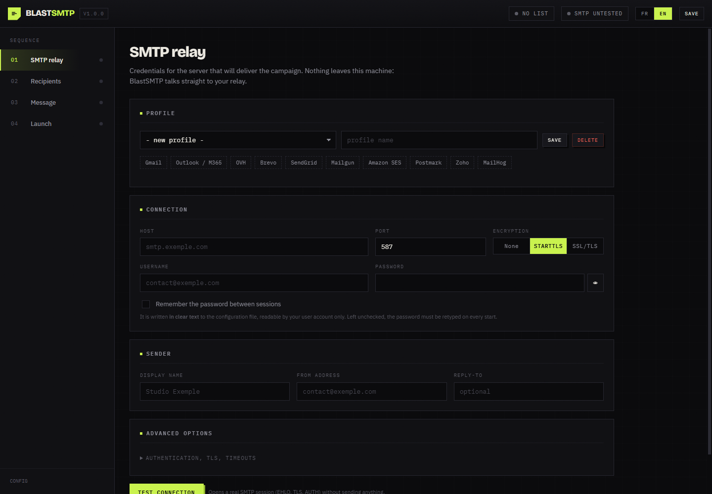

# BlastSMTP

Bulk email sender in a single Go binary.

<div align="center">
  
</div>

You fill in your SMTP relay, import a CSV or TXT list, write a message with per-recipient variables, and launch. Progress is shown live and you can pause or stop at any point.

There is no external service and no account to create. The binary serves a local web console and talks directly to your own SMTP server.

*[Version francaise](README.fr.md)*

## Contents

- [What it does](#what-it-does)
- [Install](#install)
- [Getting started](#getting-started)
- [List formats](#list-formats)
- [Variables](#variables)
- [SMTP setup](#smtp-setup)
- [Pacing and deliverability](#pacing-and-deliverability)
- [Attachments and embedded images](#attachments-and-embedded-images)
- [Security](#security)
- [HTTP API](#http-api)
- [Building](#building)
- [Development](#development)
- [Responsible use](#responsible-use)
- [Licence](#licence)

## What it does

**Single binary.** The web UI is embedded with `go:embed`. No runtime dependency, standard library only.

**Bilingual UI.** English and French, switched with one click and no reload. The choice is remembered and also applies to the CSV report headers.

**Works anywhere.** Responsive from desktop down to phone, and fully usable offline. Web fonts are a nicety, never a requirement.

**Real connection test.** Opens an actual SMTP session (EHLO, STARTTLS, AUTH) and reports latency, TLS version, cipher, advertised extensions and maximum accepted size, without sending anything.

**Forgiving import.** CSV, TSV and TXT. Delimiter, header row and address column are detected automatically. BOM handled, duplicates dropped, invalid rows listed separately with the reason.

**Modular variables.** Every column becomes `{{column}}`. On top of that: incrementing counters, dates, random values, phrase rotation, case transforms and fallback values.

**Faithful preview.** Renders the message exactly as recipient number N will receive it, random draws included. The same seed is used for the preview and the send.

**Test send.** One message to your own address, rendered with a real recipient's data.

**Controlled pacing.** Parallel connections, messages-per-minute cap, batches with a cooldown, retries with growing backoff, periodic reconnection.

**Live supervision.** Counters, progress, throughput, estimated time left, line-by-line journal. Pause, resume or stop whenever you want.

**CSV report.** Per-recipient outcome with SMTP code and error message, exportable for analysis.

**Dry run.** Renders and validates every message without opening a single connection. Nothing leaves the machine.

## Install

### From a release

Grab the executable for your platform from [Releases](../../releases) and run it. Nothing to install.

### With Go

```bash
go install github.com/aprilox/blastsmtp@v1.0.0
```

### From source

```bash
git clone https://github.com/aprilox/blastsmtp.git
cd blastsmtp
```

On Windows, the `.exe` extension matters. Without it Go writes a file Windows will not run:

```powershell
go build -o blastsmtp.exe .
.\blastsmtp.exe
```

On Linux and macOS:

```bash
go build -o blastsmtp .
./blastsmtp
```

Building requires Go 1.26 or later. Running the binary requires nothing.

> The module path is case sensitive. If you republish under another account, change `aprilox` in [go.mod](go.mod) *and* in the imports of the `.go` files, then run `go mod tidy`.

## Getting started

```bash
./blastsmtp
```

```
  BlastSMTP 1.0.0
  Console   http://127.0.0.1:7333/?token=8f3c...
  Config    C:\Users\you\AppData\Roaming\BlastSMTP\config.json
  Ctrl+C to quit
```

The browser opens on its own. Then, in order:

1. **SMTP relay.** Pick a preset (Gmail, Outlook, OVH, Brevo, SendGrid and others) to fill in host and port, add your credentials, then hit **Test connection**.
2. **Recipients.** Drop your file in. The detected columns show up as clickable variables.
3. **Message.** Write the subject and HTML body, insert variables with a click, preview against a real recipient, then send yourself a **test message**.
4. **Launch.** Set the pacing, go through the pre-flight check, and start. Try a **dry run** first.

### Command-line flags

| Flag | Default | Purpose |
|---|---|---|
| `-port` | `7333` | Listening port. `0` picks a free one. |
| `-host` | `127.0.0.1` | Listening interface. Keep it on loopback. |
| `-config` | user config directory | Where the configuration file lives. |
| `-no-browser` | | Do not open a browser on start. |
| `-version` | | Print the version and exit. |

## List formats

**CSV and TSV.** The delimiter is detected among `,` `;` tab and `|`:

```csv
Prenom;Email;Company;City
Amelie;amelie@example.com;ACME;Lyon
Bob;bob@example.com;Globex;Paris
```

Each header becomes a variable: `{{prenom}}`, `{{company}}`, `{{city}}`.

Accents are folded, so a `Prénom` column answers to `{{prenom}}` and you never have to type an accent inside a placeholder.

The address column is recognised under about thirty common names (`email`, `e-mail`, `mail`, `courriel`, `address`, `to` and others) and is always reachable as `{{email}}` whatever it was called. If no name matches, the column holding the most valid addresses wins.

**TXT.** One address per line, `#` for comments:

```
# active customers
amelie@example.com
Bob Martin <bob@example.com>
```

In every case the UTF-8 BOM is stripped, duplicates are dropped case-insensitively, and invalid lines are listed separately with their reason. Nothing is lost silently.

## Variables

Anything inside `{{ }}` is resolved at send time, in the subject, the HTML body, the text body and custom headers.

### Recipient data

| Variable | Result |
|---|---|
| `{{email}}` | The recipient address |
| `{{name}}`, `{{prenom}}`, `{{city}}` and so on | Any column from your file |
| `{{prenom\|Customer}}` | The column, or `Customer` when it is empty or missing |
| `{{emailuser}}` | Whatever precedes the `@` |
| `{{emaildomain}}` | The recipient domain |

### Counters

| Variable | Result |
|---|---|
| `{{index}}` | Position of the recipient: 1, 2, 3 and so on |
| `{{index:1000}}` | Same counter starting at 1000 |
| `{{count}}` | Total number of recipients |

The starting point can also be set globally in the **Launch** tab, which lets you carry a numbering across campaigns.

### Date and time

| Variable | Result |
|---|---|
| `{{date}}` | `04/08/2026` |
| `{{date:YYYY-MM-DD}}` | `2026-08-04` |
| `{{date:DD MMMM YYYY}}` | `04 August 2026` |
| `{{time}}` and `{{datetime}}` | `14:30` and `04/08/2026 14:30` |
| `{{year}}`, `{{month}}`, `{{day}}` | Individual parts |
| `{{timestamp}}` | Unix timestamp |

Accepted patterns: `YYYY YY MMMM MMM MM DDDD DDD DD HH hh mm ss A`.

### Randomness and variation

| Variable | Result |
|---|---|
| `{{rand:1000-9999}}` | Integer drawn in the range |
| `{{randstr:8}}` | Random alphanumeric string of 8 characters |
| `{{randnum:6}}` | Run of 6 random digits |
| `{{randhex:8}}` | Random hex string |
| `{{uuid}}` | Unique identifier |
| `{{spin:Hello;Hi;Good morning}}` | One variant at random, separated by `;` |

Draws are deterministic per recipient: the preview of recipient 42 shows exactly what recipient 42 will get.

### Transforms

| Variable | Result |
|---|---|
| `{{upper:prenom}}` | `AMELIE` |
| `{{lower:email}}` | `amelie@example.com` |
| `{{capitalize:prenom}}` | `Amelie` |
| `{{trim:city}}` | Surrounding spaces removed |

### Full example

```html
Subject: Order #{{index:1000}} confirmed, {{company|your order}}

<p>{{spin:Hello;Hi there;Good morning}} {{capitalize:prenom|valued customer}},</p>
<p>Your order <strong>#{{index:1000}}</strong> placed on {{date}} is being prepared.</p>
<p>Tracking code: {{randstr:6}}-{{randnum:4}}</p>
<p><a href="https://example.com/unsubscribe?t={{token}}">Unsubscribe</a></p>
```

An unknown variable resolves to an empty string and is **reported in the preview** before you send, never discovered afterwards.

## SMTP setup

### Ports and encryption

| Port | Mode | Use |
|---|---|---|
| 587 | STARTTLS | The current standard. Prefer this. |
| 465 | SSL/TLS | TLS from the first byte. Still very common. |
| 25 | None or STARTTLS | Internal relay. Often blocked outbound by ISPs. |
| 1025 | None | Local test servers such as MailHog or Mailpit. |

### Authentication

`Automatic` is right almost every time: the mechanism is chosen from what the server advertises, preferring `PLAIN` over TLS. Force `LOGIN` for Exchange or cPanel relays that refuse `PLAIN`, `CRAM-MD5` when the server insists, `None` for an open internal relay.

Credentials are never sent over an unencrypted connection unless you explicitly tick *Auth without TLS*, which is meant for local relays only.

### Common problems

- **Gmail or Outlook with two-factor authentication.** An app password is mandatory; the account password will be refused.
- **`server does not advertise STARTTLS`.** The server expects implicit TLS. Switch to SSL/TLS on port 465.
- **Timeout.** The outbound port is blocked by a firewall or your ISP. Very common on port 25.
- **Self-signed certificate.** Tick *Skip certificate check*, knowing what that costs you.
- **`EHLO refused`.** Set a *HELO name* that resolves publicly.
- **`connection closed by the server (EOF)`.** Not a rejection: the relay hung up without answering, usually a quota. Lower the rate, or the reconnection threshold. Note that delivery is ambiguous in this case, so a retry may produce a duplicate.

## Pacing and deliverability

Settings in the **Launch** tab:

| Setting | Effect |
|---|---|
| Parallel connections | Simultaneous SMTP sessions. One to four is almost always enough; beyond that many relays start throttling. |
| Messages per minute | Global cap across all workers. `0` removes the limit. |
| Batch size and pause | Inserts a cooldown every N messages. Most shared relays expect this from a bulk sender. |
| Retries | New attempts after a temporary failure (4xx, network) with growing backoff. Permanent refusals (5xx) are never retried. |
| Reconnect every | Opens a fresh session after N messages. Works around relays that cut off after a quota. |
| Abort on first error | Stops everything on the first permanent failure. Useful for a first test run. |

A few things that matter far more than speed:

- Set up **SPF, DKIM and DMARC** on your sending domain. Without those, the rest is pointless.
- Fill in the **unsubscribe link**. The tool then adds the `List-Unsubscribe` and `List-Unsubscribe-Post` headers that Gmail and Outlook expect for bulk sending.
- Provide a **text version** alongside the HTML. A multipart message scores better. The *Generate from HTML* button does it for you.
- **Ramp up gradually** on a new domain or IP.
- Send yourself a **test message** before every campaign and read it in a real mail client.

## Attachments and embedded images

Drop files in the **Message** tab. The limit is 25 MB total, which is about what relays accept at best.

Images have two modes, switched with one click:

- **Attached.** A regular file attachment.
- **Embedded.** The image goes into a `multipart/related` container and can be referenced from the HTML. The `cid:` button inserts the full tag:

```html

```

The MIME tree produced is the smallest one that fits the content:

```
multipart/mixed             only when there are file attachments
  multipart/related         only when there are embedded images
    multipart/alternative   only when there is both text and HTML
      text/plain
      text/html
```

## Security

The server listens on 127.0.0.1 only. It is not built to be exposed on a network.

Each start generates a random session token, required on every API call and compared in constant time. Requests from another origin are refused, so a web page open in the same browser cannot drive the tool.

SMTP passwords are **not saved** by default. If you enable saving, they are written **in clear text** to `config.json` with owner-only permissions. That is a deliberate, documented trade-off: there is no keychain without an external dependency.

Variable values cannot inject headers. Any carriage return inside a rendered header is neutralised before writing, and a test covers that case specifically.

The preview renders inside a fully sandboxed `iframe`, so message HTML cannot run scripts in the console.

The only outbound request made by the UI goes to Google Fonts, purely for typography. It is loaded without blocking the first paint, so with no network the console still opens normally using system fonts, and no campaign data ever transits there. To remove that call entirely, delete the matching `<link>` tag in [web/index.html](web/index.html). Everything else works the same.

## HTTP API

The UI is just a client of this API. Every call requires the `X-Blast-Token` header, or a `?token=` parameter.

| Method | Route | Purpose |
|---|---|---|
| `GET` | `/api/config` | Configuration and file path |
| `POST` | `/api/config` | Save profiles, draft and pacing |
| `POST` | `/api/smtp/test` | Probe a relay without sending |
| `POST` | `/api/recipients` | Import a list (multipart, field `file`) |
| `GET` `DELETE` | `/api/recipients` | Read or clear the list |
| `GET` `POST` | `/api/attachments` | List or add attachments |
| `DELETE` | `/api/attachments/{name}` | Remove an attachment |
| `POST` | `/api/attachments/{name}/inline` | Toggle attached and embedded |
| `POST` | `/api/preview` | Render the message for one recipient |
| `POST` | `/api/send-test` | Send a single message |
| `POST` | `/api/campaign/start` | Start the campaign |
| `POST` | `/api/campaign/pause` `/resume` `/stop` | Drive the campaign |
| `GET` | `/api/campaign/state` | Counters and journal |
| `GET` | `/api/campaign/stream` | Event stream (SSE) |
| `GET` | `/api/campaign/report.csv` | Per-recipient report |

## Building

No cgo is used, so cross-compiling works from any platform to any other with no C toolchain.

### Windows (PowerShell)

```powershell
go build -ldflags "-X main.version=1.0.0 -s -w" -o blastsmtp.exe .
```

Every target at once. Note that variables are set before the call, not as a prefix:

```powershell
$env:CGO_ENABLED = "0"
foreach ($t in 'windows/amd64','windows/arm64','linux/amd64','linux/arm64','darwin/amd64','darwin/arm64') {
  $os, $arch = $t -split '/'
  $out = "dist/blastsmtp-$os-$arch"
  if ($os -eq 'windows') { $out += '.exe' }
  $env:GOOS = $os; $env:GOARCH = $arch
  go build -trimpath -ldflags "-X main.version=1.0.0 -s -w" -o $out .
}
Remove-Item Env:GOOS, Env:GOARCH   # otherwise later builds stay cross-compiled
```

### Linux and macOS

```bash
go build -ldflags "-X main.version=1.0.0 -s -w" -o blastsmtp .

for t in windows/amd64 linux/amd64 darwin/arm64; do
  GOOS=${t%/*} GOARCH=${t#*/} CGO_ENABLED=0 \
    go build -trimpath -ldflags "-X main.version=1.0.0 -s -w" \
    -o "dist/blastsmtp-${t%/*}-${t#*/}" .
done
```

The web UI is embedded in the binary, so there is nothing else to ship. One file is enough.

Pushing a `v*` tag triggers [.github/workflows/release.yml](.github/workflows/release.yml), which builds the six targets, computes SHA-256 sums and publishes a GitHub release.

## Development

```bash
go test ./...              # full suite
go test -race ./...        # race detector, needs cgo
go vet ./...
gofmt -l .
```

### Layout

```
main.go                     Entry point, flags, UI embedding
internal/mailer/            MIME building and SMTP transport
    message.go              MIME tree, encodings, headers
    mailer.go               Connection, TLS, authentication, sending
    auth.go                 AUTH LOGIN and PLAIN (missing or crippled in stdlib)
internal/tmpl/              The {{ }} variable engine
internal/recipients/        CSV, TSV and TXT parsing
internal/campaign/          Scheduler: workers, pacing, recovery, events
internal/store/             Profile and draft persistence
internal/server/            HTTP API and UI serving
web/                        Embedded UI (HTML, CSS, JS, no framework)
```

Tests cover what breaks silently: MIME trees and header encoding, an attempted header injection, real-world list parsing (accents, BOM, duplicates, delimiters), variable resolution and draw reproducibility, the shipped example files, and a full SMTP conversation against an in-memory fake server covering EHLO, AUTH PLAIN and LOGIN, dot stuffing, 5xx rejection and session reuse.

## Responsible use

This tool sends email from **your** relay, under **your** identity, to the list **you** supply. What you do with it is on you.

- Only write to people who agreed to hear from you.
- Provide an unsubscribe link that works, and honour requests quickly.
- Identify the sender clearly. Do not impersonate a domain or an organisation.
- GDPR applies in Europe, the CAN-SPAM Act in the United States, CASL in Canada. Purchased or scraped lists are illegal in most jurisdictions, and they wreck your domain reputation on top of that.

BlastSMTP deliberately contains no identity spoofing, no origin hiding and no filter evasion.

## Licence

[MIT](LICENSE).
